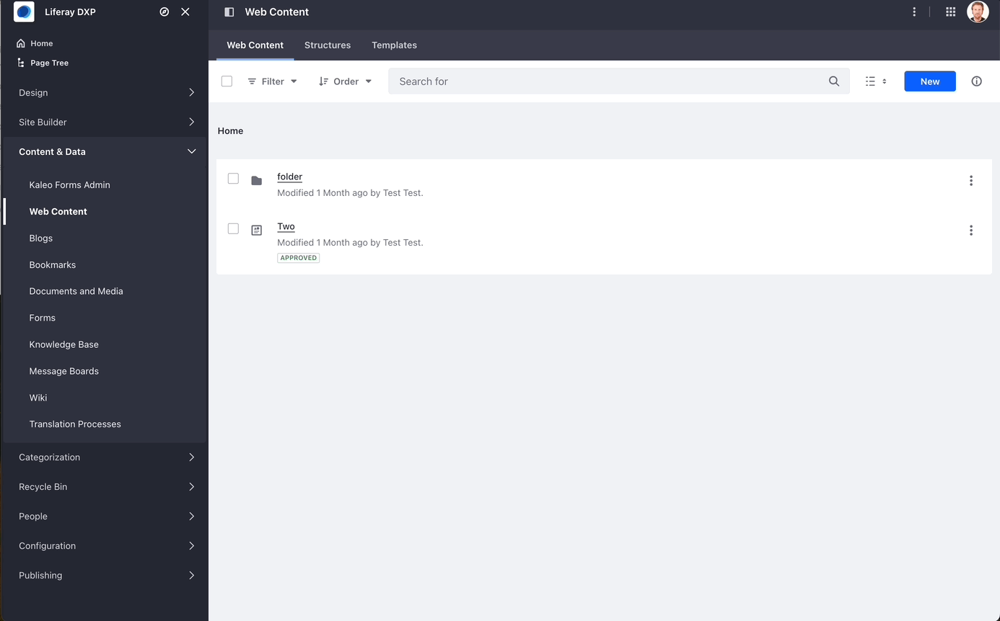

# Admin JS For Structured Content Contribution Client Extension

This Client Extension is a small example of the use of a new feature to add JS into the Liferay Administrator Pages.
This feature is available since 2024.Q4 as a Release Feature but can be tested in 2024.Q3 as a Beta Feature.

## Previous Steps

### 1. Create the required Liferay Object

* Import the Object named 'Selector':

    - [x] Import Object going to Control Panel > Objects > Import
    - [x] Import file:
        Name: Selector
        File: [Object_Definition_Selector.json](./init/Object_Definition_Selector.json)
    - [x] Publish Object.
    - [x] Add content to the Object Selector. Go to Control Panel > Selector and add some key/value options.

### 2. Create the Content Structure

* Import the Content Structure named 'News':

    - [x] Import the Control Structure. Go to Product or Site Menu > Contents & Data > Web Content > (tab) Structures > (3 dots button) Configuration > Export/Import > (tab) Import
    - [x] Import file:
        Name: News
        File: [Structure_News.json](./init/Structure_News.json)
    - [x] Click on 'Import'.

### 3. Build and Deploy the Client Extension

* Create Build and Deploy the Client Extension:

    - [x] Go to your Liferay Workspace and copy 'admin-js-for-structured-content-contribution-cx' into your client-extensions folder.
    - [x] Build and Deploy the client extension after previous task have been performed:
    ```
        ../../gradlew build
        ../../gradlew deploy
    ```
    - [x] If your workspace has been configured to deploy into your local machine, then the Client Extension should appear in your Liferay DXP. If not, you will need to copy admin-js-for-structured-content-contribution-cx/dist/admin-js-for-structured-content-contribution-cx.zip into the osgi/client-extensions folder of your bundle environment.  
    Go to Control Panel > Applications > Client Extensions and check for 'Admin JS For Structured Content Contribution Client Extension'.

## Test your Client Extension

* Go to your Site Menu > Contents & Data > Web Content. 
* Create a new Content based on the 'News' structure.
* Click on 'Type' button
* A modal menu should be shown as follows (Modal design will depend on your code, this is just an example to guide you to create your own code there):
<p align="center">
  
</p>
