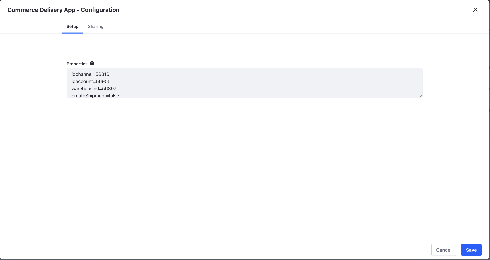
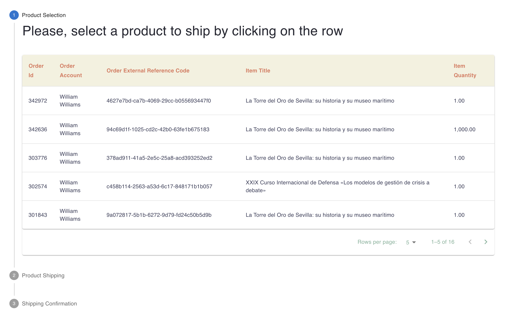
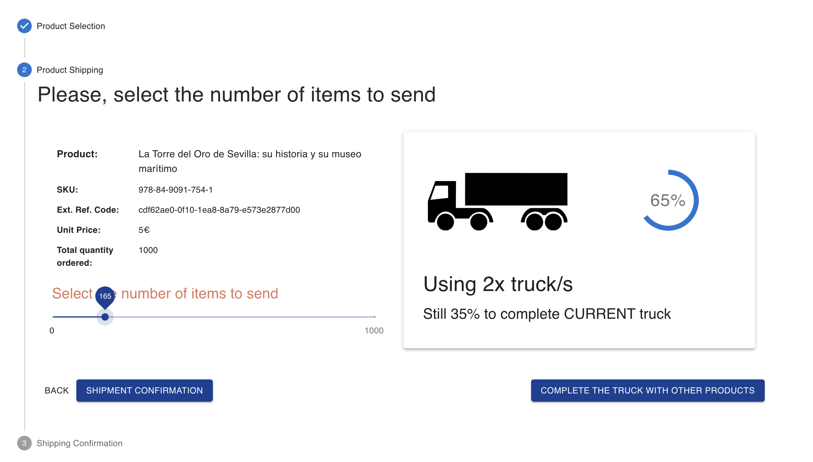
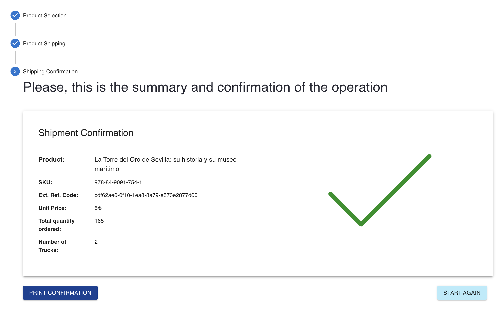
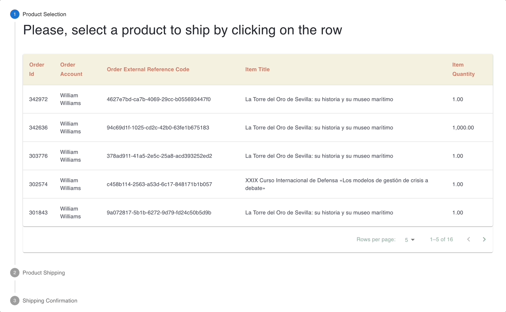

# Commerce Delivery React App

This react application shows every item for every order in Commerce, allowing to the user to select one of them and to create a shipment. Before to create the shipment, the application simulates a calculation of the number of trucks that will be needed in order to send the amount of items selected.

This application could be helpful as the beginning to create an improved application. 

The main target here is to show customers that Liferay can be extended using applications and APIs in order to help users with more capabilities, in this use case, we are providing the chance to save costs through the information of the number of trucks that will be needed to send a specific amount of products, because the user can complete the truck until it is full.

# Liferay OOTB tools
This application is a React App that are getting information from orders and products and it is updating the shipments once the user confirm the shipment. All of this through the Liferay APIs.

# Configuration
Instead of 'hardcoding' values, the Application should be configured with some Application  Properties (Application Menu > Configuration):
idchannel=
idaccount=
warehouseid=
createShipment=false

  

# Screenshots

Step One - Product selection

  

Step Two - Number of items to ship

  

Step Three - Print Confirmation or start again

  

# App in action

  

