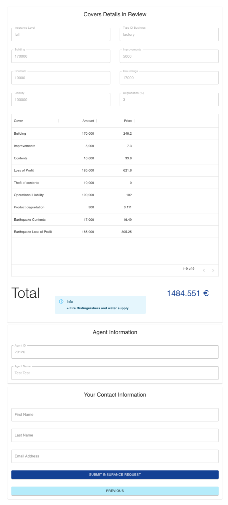

# React Insurance Calculator

**Based on Wesley Kempa's amazing work on React Loan Calculator (https://github.com/weskempa-liferay/react-loan-calculator)**, here we have the **Insurance Calculator**.

Example of a multi-step react component that leverages getting and posting Liferay Object and Picklist data. This component also contains translated content for Greek, Spanish, and English based on the user's Liferay language settings.

This application provides the capability to calculate an insurance policy based on data completed for a user agent regarding a construction or building, but it can be modified to create more covers for other types of insurance. Some fields are initialized from Picklists and data is recovered from Objects (Picklist and Objects are OOTB no-code/low-code capabilities of Liferay).

---

***Fisrt Step**: Fill out the form, select covers to apply and check additional cover if proceed*

<p align="center">
  
</p>

---

<p align="center">
  
</p>

---

***Second Step**: Review the new Insurance Application and complete the user fields. Agent information is completed automatically*

<p align="center">
  
</p>

---

***Third Step**: Information is sent to Insurance Request Object Application (or Raylife Object Application)*

<p align="center">
  
</p>

---
<br/>

## Expected Use & Previous Steps
This resource can be used as a 7.4 Remote App (Custom Element) or a Client Extension service for LXC and you need to follow the next steps:

<br/>

### 1. Create the required Lifeary Picklist

* Create Picklist named 'Package Type':

    Go to Control Panel (Bento Menu) > Picklist > New Picklist ('+' button)

    * Name: "Package Type"

    | Name     |  Key     |
    | :----:   |   :----: |
    | Full     | full     |
    | Compound | compound |
    | Simple   | simple   |

* Create Picklist named 'Type of Business':

    Go to Control Panel (Bento Menu) > Picklist > New Picklist ('+' button)

    * Name: "Type of Business"

    | Name                         |  Key                    |
    | :----:                       |   :----:                |
    | Super Markets - Mini Markets | superMarketsMiniMarkets |
    | Factory                      | factory                 |
    | Restaurant                   | restaurant              |

<br/>

### 2. Create the required Lifeary Objects

* Create Object named 'PackageCoversRate':

    - [x] Import Object going to Control Panel (Bento Menu) > Objects > Import (Kebab Menu)
    - [x] Import file:
        Name: PackageCoversRate
        File: [Object_PackageCoversRates.json](./init/Object_PackageCoversRates.json)
    - [x] Create new field (picklist fields are not imported properly):
        Label: Type Of Business
        Field Name: typeOfBusiness
        Type: Picklist
        Picklist: Type of Business
    - [x] Add new field to the Object Layouts and Views:
        Layouts > Default > Insurance Data Block
        Views > Default > Column 'Type of Business'
    - [x] Publish Object.
    - [x] Import data:
        Go to your Liferay API Explorer: `[YOUR_DOMAIN]/o/api?endpoint=[YOUR_DOMAIN]/o/c/packagecoversrates/openapi.json`
            Look for the POST /batch API of `packagecoversrates`.
            Copy the content of [import-data-object-PackageCoverRates.json](./init/import-data-object-PackageCoverRates.json) into the Request body (application/json).
            Press 'execute' button.
    

* Create Object named 'InsuranceRequest':

    - [x] Import Object going to Control Panel (Bento Menu) > Objects > Import (Kebab Menu)
    - [x] Import file:
        Name: InsuranceRequest
        File: [Object_InsuranceRequest.json](./init/Object_InsuranceRequest.json)
    - [x] Create new field (picklist fields are not imported properly):
        Label: Type Of Business
        Field Name: typeOfBusiness
        Type: Picklist
        Picklist: Type of Business
    - [x] Add new field to the Object Layouts and Views:
        Layouts > Default > Insurance Data Block
        Views > Default > Column 'Type of Business'
    - [x] Publish Object.

<br/>

### 3. Clone Repo and Install Packages

Some adjusment have to be done before the application works:
* Clone or download the repo.
* Go to src/components/InsuranceDetail.js:
    - Update the Picklist ID in URL of `fetchTypeOfBusiness` method.
    ID can be found in the Liferay API Explorer: `[YOUR_DOMAIN]/o/api?endpoint=\[YOUR_DOMAIN\]/o/headless-admin-list-type/v1.0/openapi.json`
    Go to GET method of `/v1.0/list-type-definitions` 
    Search by 'Business' (Field 'Search').
    Get the id attribute.
    - Update the Picklist ID in URL of `fetchPackage` method.
    ID can be found in the Liferay API Explorer: `[YOUR_DOMAIN]/o/api?endpoint=\[YOUR_DOMAIN\]/o/headless-admin-list-type/v1.0/openapi.json`
    Go to GET method of `/v1.0/list-type-definitions` 
    Search by 'Business' (Field 'Search').
    Get the id attribute.
* Run the following (maybe you need `npm install`):
```
yarn build
yarn install
```
<br/>

## Display Method Options

The Insurance Calculator can be added to your Liferay Platform using Remote Apps:

* Decide how are you going to deploy the App:

    * [Option 1] Adding JS and CSS to the Document Library. For example http://localhost:3000/static/js/bundle.js in your localhost.
    * [Option 2] Hosted on Remote Server (Make sure to set the CORs Policy to support this approach if on a separate domain).
    * [Option 3] LXC Client Extension Service.
    * [Option 4] Hosted on Liferay Server in webapps.

* Create the Remote App as a Custom Element Application:

  * Go to Control Panel (Bento Menu) > Applications > Remote Apps > Add Cutom Element ('+' button)

  | Field               | Value                 |
  | :---                | :----                 |
  | HTML Element Name   | insurance-calculator  |
  | urls                | path to main.js       |
  | cssURLs             | path to main.css      |


